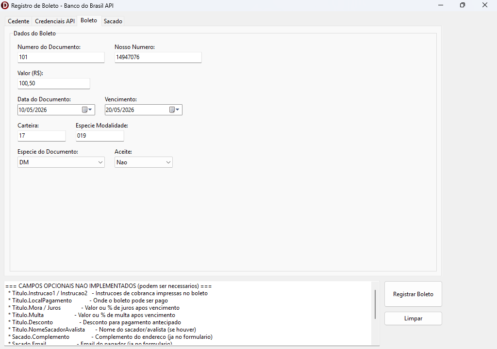

# Registro de Boleto — Banco do Brasil API

Aplicação desktop desenvolvida em **Delphi (VCL)** para registro de boletos bancários via **API oficial do Banco do Brasil**, utilizando a biblioteca open-source **ACBr**.

---

## Screenshot



> Adicione uma captura de tela do formulário na pasta `docs/` com o nome `screenshot.png`

---

## Sobre o Projeto

Implementa o fluxo completo de emissão de boleto bancário integrado à API de Cobranças do Banco do Brasil (v2), cobrindo autenticação OAuth 2.0, registro via REST, geração de PDF com FastReport e suporte a QR Code PIX.

---

## Funcionalidades

- **Formulário multi-abas** com separação clara de dados: Cedente, Credenciais API, Boleto e Sacado
- **Autenticação OAuth 2.0** via `TNetHTTPClient` (nativo do Delphi, sem dependência de OpenSSL)
- **Envio do boleto** via `WinHttp.WinHttpRequest.5.1` (COM nativo do Windows), garantindo compatibilidade com TLS 1.2
- **Geração de PDF** com FastReport (`TACBrBoletoFCFR`) e abertura automática no visualizador padrão
- **QR Code PIX** embutido no boleto quando habilitado
- Log detalhado de requisições para auditoria e depuração
- Alternância entre **sandbox** e **produção** por checkbox

---

## Stack Técnica

| Tecnologia | Uso |
|---|---|
| Delphi VCL (Win32) | Framework principal |
| ACBr (`TACBrBoleto`) | Cálculos bancários, linha digitável, código de barras |
| FastReport via ACBr | Geração do PDF do boleto |
| `System.Net.HttpClient` | Autenticação OAuth (TLS nativo do Windows) |
| `WinHttp` COM | POST do boleto via API REST com TLS 1.2 |
| `System.JSON` | Parse das respostas da API |

---

## Decisão Técnica — Por que não usar o HTTP interno do ACBr?

O ACBr utiliza **Synapse** (`httpsend`) para todas as chamadas REST, o que exige OpenSSL instalado. Em ambientes Windows sem OpenSSL configurado isso gera falha na autenticação.

**Solução adotada:**
- OAuth → `TNetHTTPClient` (pilha WinHttp nativa, sem OpenSSL)
- Registro do boleto → `WinHttp.WinHttpRequest.5.1` via COM (suporte TLS 1.2 out-of-the-box)

Essa abordagem elimina dependências externas e funciona em qualquer Windows sem configurações adicionais.

---

## Fluxo de Execução

```
Usuário preenche os dados
        ↓
Validação dos campos obrigatórios
        ↓
Obtenção do token OAuth 2.0 (Bearer)
        ↓
Montagem do payload JSON do boleto
        ↓
POST para api.bb.com.br/cobrancas/v2/boletos
        ↓
Parse do retorno (NossoNumero, QR Code PIX)
        ↓
Geração e abertura automática do PDF
```

---

## Pré-requisitos

- RAD Studio / Delphi 10.4+
- Componentes [ACBr](https://projetoacbr.com.br/) instalados
- FastReport (distribuído junto ao ACBr)
- Credenciais da API do Banco do Brasil (ClientID, ClientSecret, App Key)
- **Não requer OpenSSL**

---

## Configuração

1. Clone o repositório e abra `BancoDoBrasilAP1.dproj` no RAD Studio
2. Compile e execute
3. Na aba **Credenciais**, informe:
   - Client ID e Client Secret (obtidos no [Portal Desenvolvedor BB](https://developers.bb.com.br))
   - App Key (`gw-dev-app-key`)
   - Scope: `cobrancas.boletos-requisicao`
4. Na aba **Cedente**, informe agência, conta, convênio, carteira e modalidade
5. Marque **Homologação** para usar o sandbox do BB
6. Clique em **Registrar Boleto** — o PDF será gerado e aberto automaticamente

---

## Estrutura do Projeto

```
├── BancoDoBrasilAP1.dpr       # Projeto Delphi
├── BancoDoBrasilAP1.dproj     # Configurações do projeto
├── BoletoBB.pas               # Lógica principal do formulário
├── BoletoBB.dfm               # Layout VCL do formulário
├── Boleto.fr3                 # Template FastReport do boleto
└── Win32/Debug/
    └── BoletoFR.fr3           # Template em uso pelo executável
```

---

## Observações

- O projeto está pré-configurado para o **sandbox** do Banco do Brasil
- Para produção, desmarque "Homologação" e use credenciais reais
- **Nunca publique credenciais reais** em repositórios públicos
- PDF gerado em: `%USERPROFILE%\Documents\BoletoFast.pdf`
- Log em: `%USERPROFILE%\Documents\Log_Boleto_BB.txt`

---

## Referências

- [Portal do Desenvolvedor Banco do Brasil](https://developers.bb.com.br)
- [Documentação ACBr](https://www.projetoacbr.com.br)
- [ACBr no GitHub](https://github.com/projetoacbr/ACBr)

